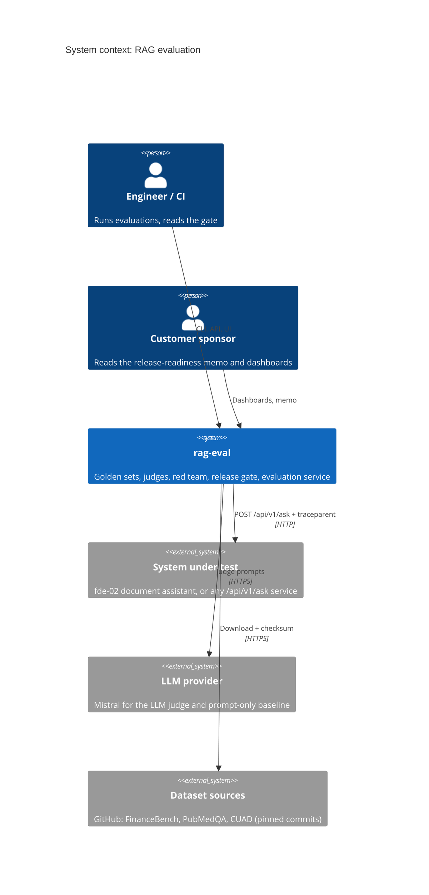
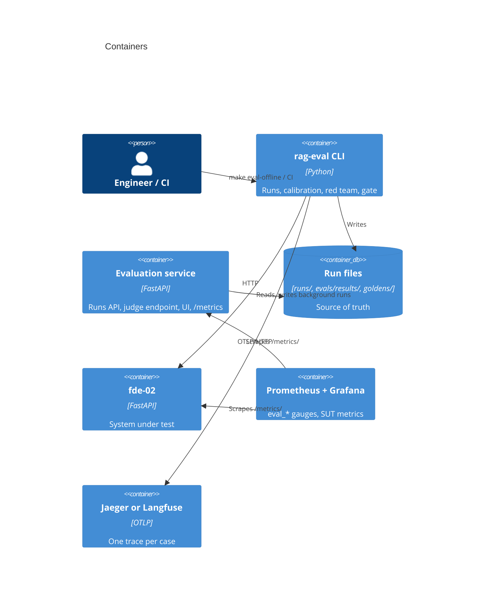

# C4 views

## Level 1: System context

```mermaid
C4Context
  title System context: RAG evaluation
  Person(eng, "Engineer / CI", "Runs evaluations, reads the gate")
  Person(sponsor, "Customer sponsor", "Reads the release-readiness memo and dashboards")
  System(eval, "rag-eval", "Golden sets, judges, red team, release gate, evaluation service")
  System_Ext(sut, "System under test", "fde-02 document assistant, or any /api/v1/ask service")
  System_Ext(llm, "LLM provider", "Mistral for the LLM judge and prompt-only baseline")
  System_Ext(src, "Dataset sources", "GitHub: FinanceBench, PubMedQA, CUAD (pinned commits)")
  Rel(eng, eval, "CLI, API, UI")
  Rel(sponsor, eval, "Dashboards, memo")
  Rel(eval, sut, "POST /api/v1/ask + traceparent", "HTTP")
  Rel(eval, llm, "Judge prompts", "HTTPS")
  Rel(eval, src, "Download + checksum", "HTTPS")
```

## Level 2: Containers

```mermaid
C4Container
  title Containers
  Person(eng, "Engineer / CI")
  Container(cli, "rag-eval CLI", "Python", "Runs, calibration, red team, gate")
  Container(api, "Evaluation service", "FastAPI", "Runs API, judge endpoint, UI, /metrics")
  ContainerDb(files, "Run files", "runs/, evals/results/, goldens/", "Source of truth")
  Container(sut, "fde-02", "FastAPI", "System under test")
  Container(prom, "Prometheus + Grafana", "", "eval_* gauges, SUT metrics")
  Container(jaeger, "Jaeger or Langfuse", "OTLP", "One trace per case")
  Rel(eng, cli, "make eval-offline / CI")
  Rel(cli, sut, "HTTP")
  Rel(cli, files, "Writes")
  Rel(api, files, "Reads, writes background runs")
  Rel(prom, api, "Scrapes /metrics/")
  Rel(prom, sut, "Scrapes /metrics/")
  Rel(cli, jaeger, "OTLP/HTTP")
```

## Level 3: Components

See [ARCHITECTURE.md](ARCHITECTURE.md#components).
